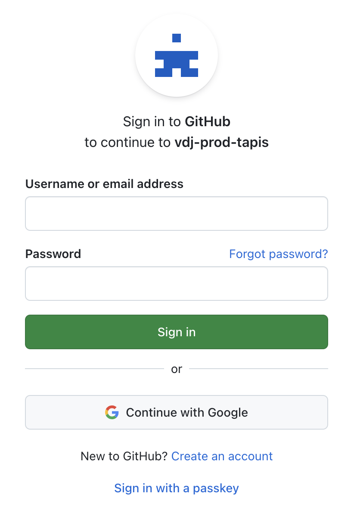

=======================
Getting Started
=======================

<insert black eyed peas>

Create a VDJServer Account
--------------------------
.. figure:: user_images/home.png
.. figure:: user_images/login_options.png

.. figure:: user_images/login_institution.png
.. figure:: user_images/institution_page.png
.. figure:: user_images/institution_terms.png
.. figure:: user_images/institution_aggrement.png
.. figure:: user_images/tapis_connect.png
.. figure:: user_images/login_google.png
.. figure:: user_images/login_orcid.png
.. figure:: user_images/my_projects.png
To create...

Account Troubleshooting
-----------------------

Verification Check, resend email
Send Feedback

Create a New Project
----------------------

Upload Files
---------------

Metadata Entry
--------------

Run Analysis Jobs
---------------------

Share Your Data
---------------

Publish Your Study
------------------

Tutorials, examples and workflows
---------------------------------

.. toctree::
   :maxdepth: 1
