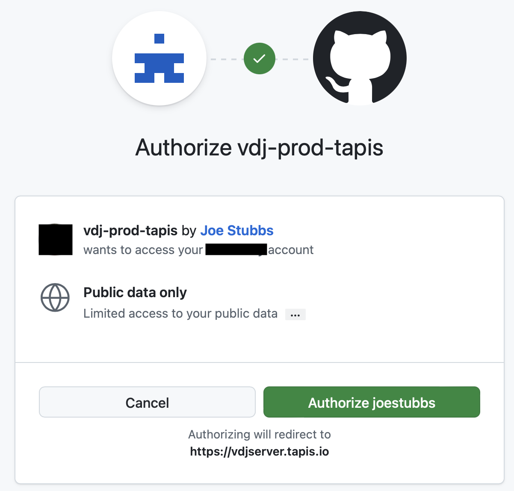

=======================
Connect GitHub Account
=======================

If you have a GitHub account (github.com) then you can use it for VDJServer.
To get started, go to the `VDJServer <https://vdjserver.org>`_ website with your web
browser as shown in the figure below.

.. figure:: user_images/home.png

Click on the "Login with ..." button, and you will be taken to a Tapis options
page that provides a number of login options.

.. figure:: user_images/login_options.png

Click on the "GitHub Accounts" button from the Tapis options.
This will display the GitHub login page as shown below.

.. figure:: user_images/login_github.png

Login with GitHub as normal. This may require additional two-factor authentication or
other security measures depending upon your GitHub account.
After you successfully login, GitHub will ask to authorize
"vdj-prod-tapis by Joe Stubbs". The following
screenshot shows an example. Review the information and click "Authorize" button to accept.

At any time, you can go into your GitHub settings; under Applications / Authorized OAuth Apps,
you can review the authorization and revoke access, if desired. If you revoke access, you can
re-connect your GitHub account with VDJServer by going through these same steps.

Finally, you will be redirected back to the Tapis webpage to finish connecting your
account to VDJServer as shown below. Click "Connect" to finish the process.

.. figure:: user_images/tapis_connect.png

If authentication worked properly, you will be shown the VDJServer My Projects page.
In the future, you will not need to repeat the intermediate authorization steps.

Congratulations! The full capabilities of VDJServer are now available for you to use.

.. figure:: user_images/my_projects.png

