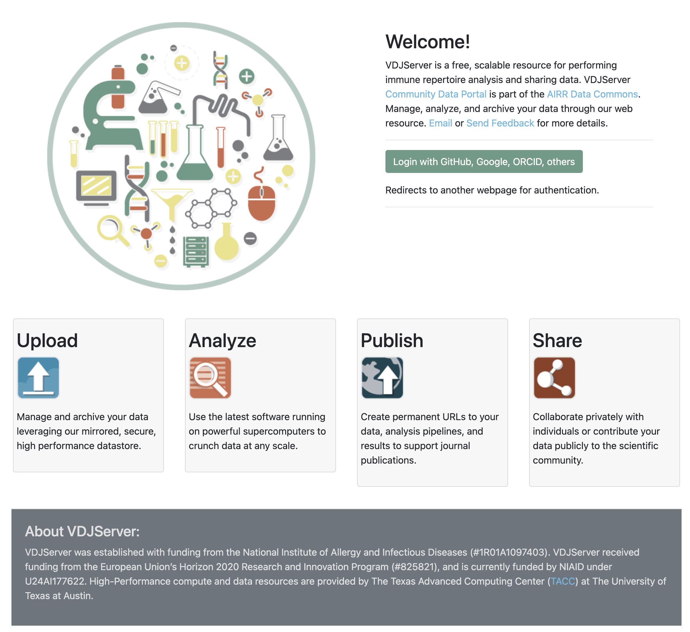
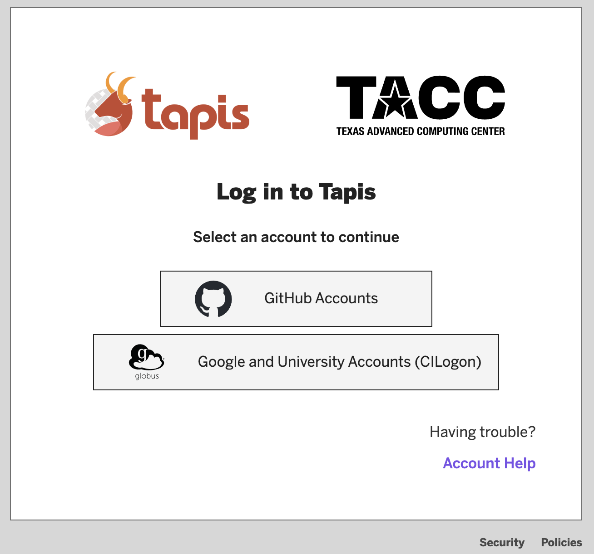
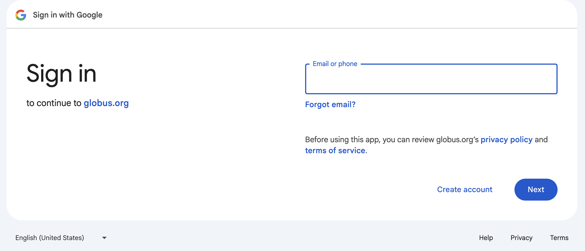
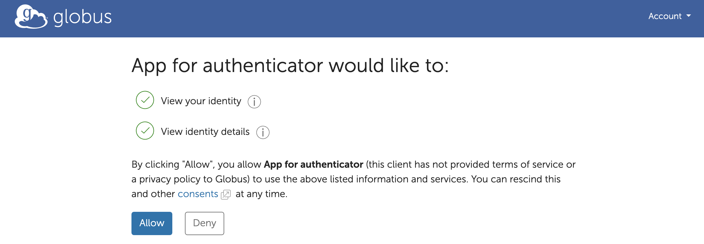

===================================
Connect Google Account using Globus
===================================

If you have a Google email account (gmail.com) then you can use it for VDJServer.
To get started, go to the `VDJServer <https://vdjserver.org>`_ website with your web
browser as shown in the figure below.

Click on the "Login with ..." button, and you will be taken to a Tapis options
page that provides a number of login options.

Click on the "Google and University Accounts (CILogin)" button from the Tapis options.
This will display the Globus login page as shown below.

.. figure:: user_images/globus_login.png

At the bottom, under
"LOG IN USING LESS COMMON OPTIONS", click on the Google icon. This will redirect
to the Google login page.

Login with Google as normal. This may require additional two-factor authentication or
other security measures depending upon your Google account.
After you successfully login with Google, you will be redirected back to
the Globus website. Globus will require you to accept their terms of service.

.. figure:: user_images/institution_terms.png

Globus will now require certain information in order to enable authentication services.
Globus shows the type of information that you need to allow for access. The following
screenshot shows an example. Review the information and click "Allow" button to accept.

Finally, you will be redirected back to the Tapis webpage to finish connecting your
3rd party account to VDJServer as shown below. Click "Connect" to finish the process.

.. figure:: user_images/tapis_connect.png

If authentication worked properly, you will be shown the VDJServer My Projects page.
In the future, you will not need to repeat the intermediate authorization steps.

Congratulations! The full capabilities of VDJServer are now available for you to use.

.. figure:: user_images/my_projects.png

