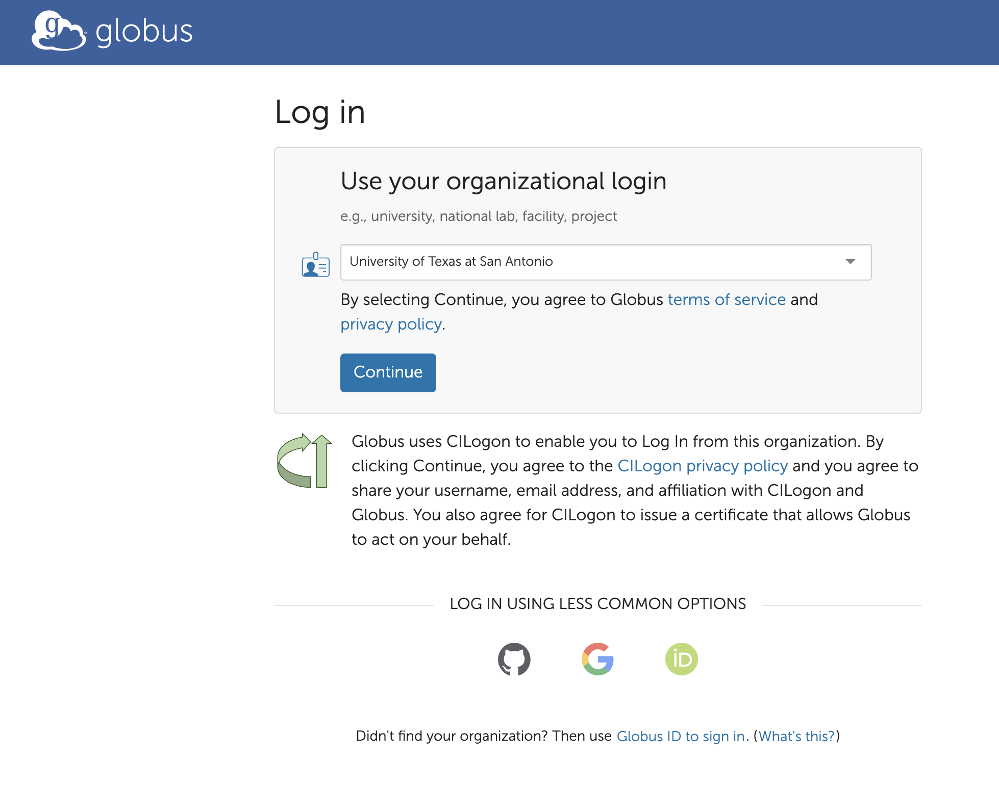
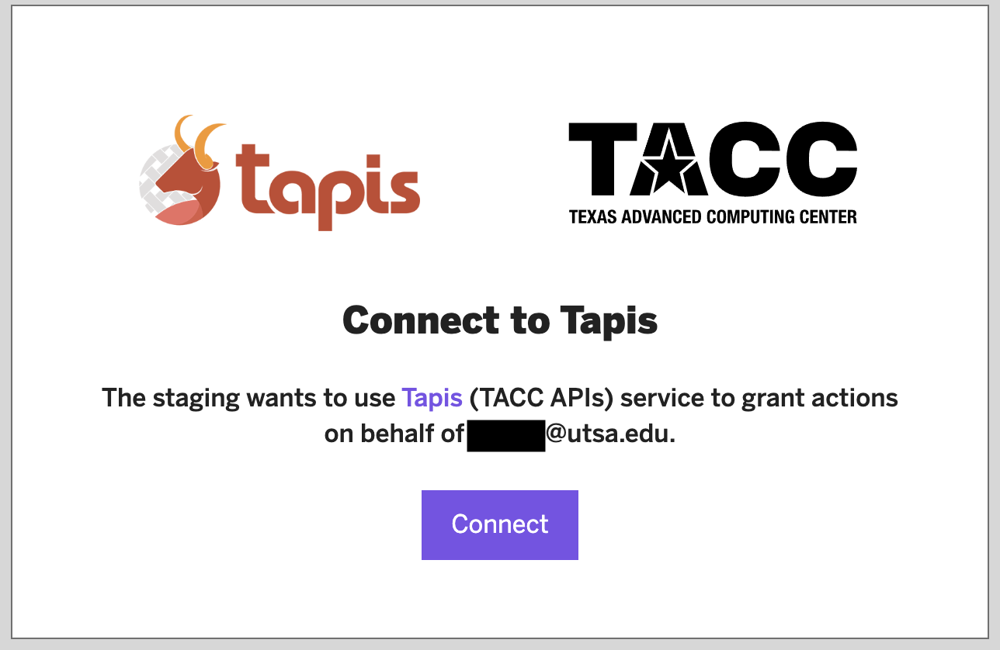
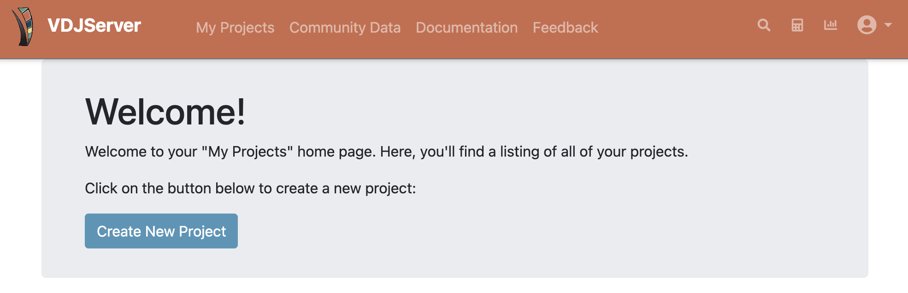

==========================================
Connect University Account using Globus
==========================================

Universities that support Globus authentication can be used for VDJServer.
Not all universities support this option, but many do.

To get started, go to the `VDJServer <https://vdjserver.org>`_ website with your web
browser as shown in the figure below.

.. figure:: user_images/home.png

Click on the "Login with ..." button, and you will be taken to a Tapis options
page that provides a number of login options.

.. figure:: user_images/login_options.png

Click on the "Google and University Accounts (CILogin)" button from the Tapis options.
This will display the Globus login page as shown below. In the dropdown search
box, find your institution. The example screenshot below shows the University of Texas at
San Antonio.

If your institution is not available, then you will need to connect a different
account to VDJServer. In this case, go back to the `VDJServer <https://vdjserver.org>`_
home page and pick another login choice.

If your institution is available then the "Continue" button will redirect to your
institution's login page. Here is a screenshot showing the login for the University
of Texas as San Antonio. Login with your institution as normal. This may require
additional two-factor authentication or other security measures depending upon your
institutional requirements.

.. figure:: user_images/institution_page.png

After you successfully login with your institution, you will be redirected back to
the Globus website. Globus will require you to accept their terms of service.

.. figure:: user_images/institution_terms.png

Globus will now require certain information in order to enable authentication services.
Globus shows the type of information that you need to allow for access. The following
screenshot shows an example. Review the information and click "Allow" button to accept.

.. figure:: user_images/institution_agreement.png

Finally, you will be redirected back to the Tapis webpage to finish connecting your
3rd party account to VDJServer as shown below. Click "Connect" to finish the process.

If authentication worked properly, you will be shown the VDJServer My Projects page.
In the future, you will not need to repeat the intermediate authorization steps.

Congratulations! The full capabilities of VDJServer are now available for you to use.

